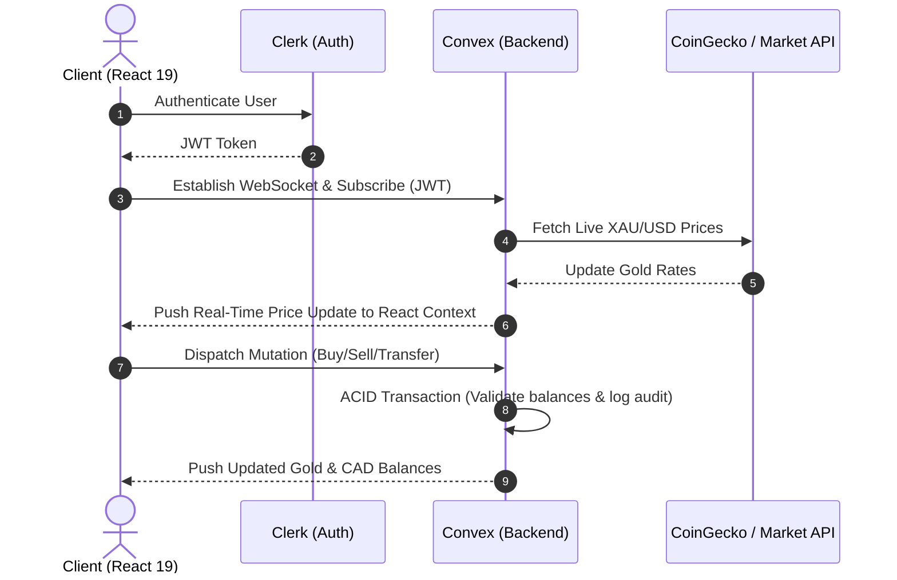

# 💎 BitGold — Premium Physical Gold Investment Ecosystem 

[](YOUR_DEMO_LINK_HERE)

BitGold is a high-fidelity full-stack fintech platform designed to bridge the gap between digital convenience and physical wealth. By leveraging real-time market data, automated investment algorithms, and secure cloud infrastructure, BitGold empowers users to build a tangible gold reserve effortlessly.
I
Built with a **Gold-Standard** tech stack, BitGold transforms daily transactions into a step toward physical financial sovereignty.

**Real-World Gold Market Integration:** BitGold fetches live, real-world **XAU/USD** gold price index feeds. Every transaction, simulation, automated round-up, and savings goal is directly pegged to real-time global spot gold exchange rates.

---

## 🎨 Premium Dark Aesthetic & UI/UX

BitGold is built with a mobile-first philosophy, prioritizing touch interactions and visually stunning layouts:
*   **Glassmorphic Design:** Sleek, translucent cards with gold-gradient borders, fluid hover states, and smooth micro-animations powered by **Framer Motion**.
*   **Real-Time Fidelity:** Live XAU/USD gold pricing tracking with custom intervals, real-time spread calculators, and high-performance charts using **Recharts**.
*   **The Vault:** A physical representation of digital assets, allowing users to track real gold bars and audit logs verified by third-party auditors.

---

## 🚀 Key Technical Features

### 1. Real-Time Data Engine & Convex Backend
*   **Reactive Queries:** Zero polling. UI updates instantly when the database changes, powered by Convex's WebSocket-based pub/sub architecture.
*   **Serverless Execution:** Secure backend transactions and automation logic written in TypeScript, running in isolated V8 sandboxes.

### 2. Automated Investment Pipeline
*   **Spare Change Round-Ups:** Rounds card transactions to the nearest dollar, multiplying the "spare change" (up to 10x) and converting it to 99.9% pure gold.
*   **Auto-Pilot SIP:** Configurable recurring gold purchases (Daily, Weekly, Monthly) that execute automatically on scheduling loops.
*   **Savings Goals:** Dynamic tracking of gold savings goals with progress bars and deadline metrics.

### 3. Trust & Banking Layer
*   **Bank Account Linking:** Automated simulation of secure bank connections, checking/savings types, and balance tracking.
*   **Deposits & Withdrawals:** High-integrity double-entry ledger that transfers fiat CAD to and from linked accounts.
*   **Secure Audit Trail:** Public audit logs verifying physical gold bar serial numbers, vault allocations, and official audit dates.

### 4. Viral Growth & Peer-to-Peer Transfers
*   **Gold Gifting:** Send gold directly to peer email addresses with secure, randomly generated 6-character claim codes (e.g., `BG-X82F1P`).
*   **Referral Network:** Dual-incentive invite system giving both referrer and referee $10 CAD upon successful referral completion.

### 5. Multi-Tenant Auth & Security
*   **Clerk Auth & JWT Session Sync:** Robust session management, integrating OAuth and user profile syncing into Convex database records.
*   **TOTP Two-Factor Authentication:** Functional 2FA with QR code generation and verification for high-risk vault operations.
*   **Biometrics Simulation:** TouchID/FaceID validation flows for premium devices.

---

## 📐 System Architecture

### Real-Time Data Flow


### Automation & Transaction Engine
```mermaid
graph TD
    A[User Setup: Round-Up/SIP] --> B{Trigger Event}
    B -- SIP Schedule reached --> C[Calculate CAD Amount]
    B -- Bank Card Transaction --> D[Calculate Round-Up Spare Change]
    D --> E[Apply Multiplier (1x-10x)]
    C --> F[Query Live Gold Rate]
    E --> F
    F --> G{Validate CAD Balance}
    G -- Insufficient --o H[Log Transaction Status: Failed]
    G -- Sufficient --> I[Debit CAD / Credit Gold Balance]
    I --> J[Write Transaction Audit Log]
    J --> K[Update React UI State]
```

---

## 🛠️ Technical Stack

| Layer | Technology | Purpose |
| :--- | :--- | :--- |
| **Frontend** | React 19 + Vite | High-performance, type-safe reactive SPA |
| **State Management** | React Context API | Global live market feeds and location mapping |
| **Backend** | Convex | Serverless real-time database, mutations, and queries |
| **Auth** | Clerk | Multi-tenant session state & identity security |
| **Styling** | Tailwind CSS | Utility-first responsive dark design system |
| **Motion** | Framer Motion | Fluid pages transitions & micro-interactions |
| **Charts** | Recharts | SVG-based responsive analytics and historical plots |
| **Monitoring** | Sentry | Performance tracing & frontend error logging |

---

## 📦 Database Schema Design

Convex enforces typescript-first schemas (`convex/schema.ts`):

*   **`users`**: Contains fiat balances (`cadBalance`), gold balances (`goldBalance`), verification status, and 2FA credentials (`is2FAEnabled`, `totpSecret`).
*   **`transactions`**: Double-entry bookkeeping ledger tracking `buy`, `sell`, `deposit`, `withdraw`, `gift_send`, `gift_claim`, and `redeem` actions.
*   **`roundup_settings`**: Stores custom multipliers (e.g. 1x, 2x, 5x, 10x) and linked card account masks.
*   **`recurring_buys`**: Tracks recurring schedule intervals (daily, weekly, monthly) and next execution Unix timestamps.
*   **`savings_goals`**: Tracks target assets, deadlines, and current progress.
*   **`bank_accounts`**: Stores verified routing/account details and simulated financial balances.
*   **`audit_logs`**: Public-facing security ledger connecting physical gold serials to verification protocols.
*   **`referrals`**: Connects referring user IDs to referee IDs and status states.
*   **`gifts`**: Manages secure peer transfers, claim codes, and expiration intervals.
*   **`delivery_requests`**: Manages logistics for physical gold bar shipments (1g, 5g, 10g Swiss).

---

## 📁 Repository Structure

```text
├── convex/
│   ├── _generated/       # Type-safe client bindings generated by Convex CLI
│   ├── auth.config.ts    # Clerk issuer domain mapping
│   ├── auth.ts           # Authentication utility helpers
│   ├── schema.ts         # Strictly-typed database schema definition
│   ├── users.ts          # User account creation, 2FA, and balance functions
│   ├── transactions.ts   # Buy/sell trade executors with ACID guarantees
│   ├── banking.ts        # Bank account linkers, deposits, and delivery requests
│   ├── automation.ts     # SIP creation, goal updates, and round-up settings
│   ├── social.ts         # Gift transfers, claim code verification, referrals
│   └── http.ts           # Incoming Webhook endpoints (Clerk account sync)
├── src/
│   ├── components/
│   │   ├── automation/   # RoundUpCard, SipConfig, GoalTracker
│   │   ├── trade/        # SellFlow, SpreadTracker, TradeInputModal
│   │   ├── brand/        # SVG Icons & BitGold logos
│   │   └── ui/           # Accessible button, input, dialog design systems
│   ├── context/
│   │   ├── GoldContext.tsx    # Live market rates and pricing state
│   │   └── LocationContext.tsx # User geographical mapping
│   ├── hooks/
│   │   └── useCurrentUser.ts  # Clerk session user data resolver
│   ├── pages/
│   │   ├── Home.tsx      # Main dashboard with vault metrics
│   │   ├── Profile.tsx   # Account settings, 2FA setup, referrals
│   │   ├── Trade.tsx     # Active buy/sell interface with charts
│   │   ├── Portfolio.tsx # Asset allocation and goal metrics
│   │   ├── Redeem.tsx    # Physical gold logistics request form
│   │   └── SignIn.tsx    # Clerk authentication gateway
│   ├── lib/
│   │   ├── goldApi.ts    # Market index rates and mock generation feeds
│   │   └── utils.ts      # Tailwind class merger utils
│   ├── App.tsx           # Route layout and app frame wrappers
│   └── main.tsx          # App entry point
├── vercel.json           # Vercel deployment configuration & SPA routing fallback
```

---

## 🚀 Installation & Setup

### Prerequisites
*   Node.js (v18+)
*   A Convex account (for backend hosting)
*   A Clerk account (for user authentication)

### 1. Clone & Install Dependencies
```bash
git clone https://github.com/SharveshKandavel/Revamp-AI.git
cd bitgold_fintech_investment_app
npm install
```

### 2. Configure Environment Variables
Create a `.env.local` file in the root directory:
```env
# Convex URL (obtained after running `npx convex dev`)
VITE_CONVEX_URL=https://your-deployment.convex.cloud

# Clerk Keys
VITE_CLERK_PUBLISHABLE_KEY=pk_test_...
CLERK_SECRET_KEY=sk_test_...

# Sentry Monitoring
VITE_SENTRY_DSN=https://your-dsn@sentry.io/project
```

### 3. Run Development Environment
BitGold features a integrated script to run both the Vite dev server and Convex compiler concurrently:
```bash
npm run dev
```

### 4. Build for Production
```bash
npm run build
```

---

## 🛡️ Stability & Telemetry
BitGold uses **Sentry** to log client exceptions, performance anomalies, and mutation failures. High-value transactions are protected by Convex’s optimistic updates to guarantee a zero-latency UI while maintaining database integrity.

---

## 📜 Disclaimer
BitGold is an educational prototype and financial simulator. No real money or physical gold is transferred, and all transactions, balances, and vault holdings are simulated for demonstration purposes.

*Built for the future of digital asset sovereignty.*

